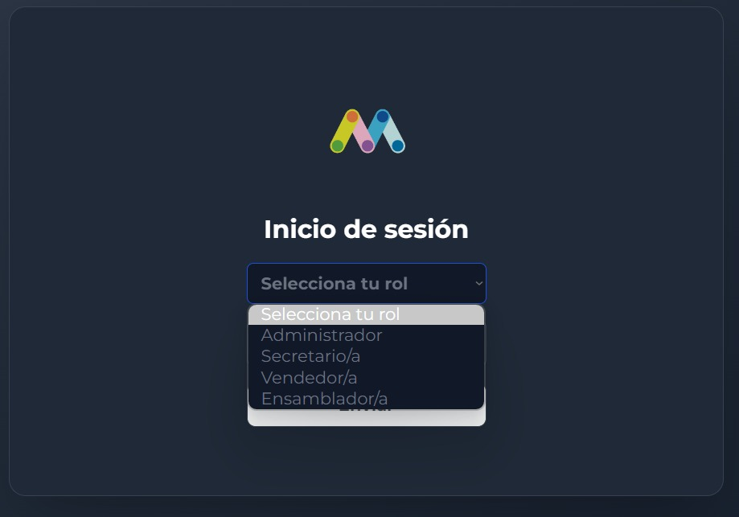

<h1 align="center">
  <br>
  <a href="http://www.amitmerchant.com/electron-markdownify"></a>
  <br>
  MarketMix ShoesApp
  <br>
</h1>

<h4 align="center">A minimum manageable shoe store <a href="https://vuejs.org" target="_blank">Vue.js</a>.</h4>

<p align="center">
  <a href="#how-to-use">How To Use</a> •
  <a href="#license">License</a>
  <a href="#live-demo">Live Demo</a>
  
</p>


## How To Use

To clone and run this application, you'll need [Git](https://git-scm.com) and [Node.js](https://nodejs.org/en/download/) (which comes with [npm](http://npmjs.com)) installed on your computer. From your command line:

```bash
# Clone this repository
$ git clone https://github.com/sebastian-crow/marketmix-shoesapp

# Go into the repository
$ cd marketmix-shoesapp

# Install dependencies
$ yarn install

# Run the app
$ yarn serve
```

## Live Demo

```bash

 https://github.com/sebastian-crow/marketmix-shoesapp

```

## License

MIT

---

> [SebastianCrow](https://github.com/sebastian-crow) &nbsp;&middot;&nbsp;

```

```
